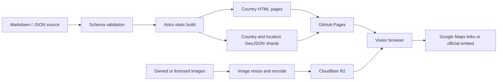
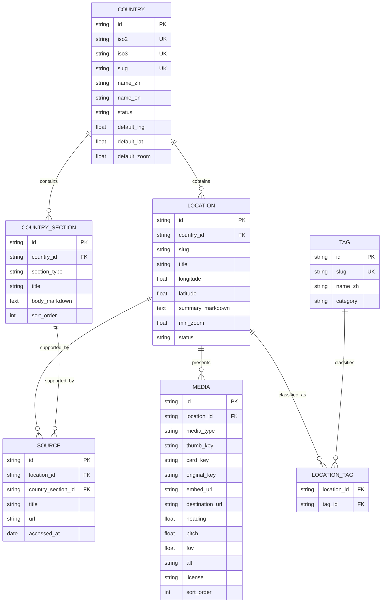

# Geo Pub 产品与数据设计文档

> 状态：初稿，作为首版开发基线  
> 项目仓库：`siriuslala/geo_pub`  
> 目标站点：`https://siriuslala.github.io/geo_pub/`  
> 最后更新：2026-08-17

## 1. 项目概述

Geo Pub 是一个以交互式世界地图为入口的个人“图寻资料库”。它不是一篇按时间排列的传统博客，而是一套可以持续积累、按国家和地理位置浏览的街景观察笔记。

网站的核心体验分为两层：

1. 世界地图层：用户可以像使用常见在线地图一样拖拽和缩放地图，从国家进入国家资料页，并在放大后浏览地图上的街景观察点。
2. 国家资料层：每个国家拥有独立页面，系统整理该国的植被、道路、街景覆盖、车辆、标志、建筑和其他图寻线索。

项目首版是一个部署在 GitHub Pages 上的纯静态网站，不要求登录、不收集用户信息，也不需要一台长期运行的后端服务器。

## 2. 产品目标

### 2.1 首要目标

- 用地图而不是文章列表作为资料库首页。
- 让用户从“国家”和“具体位置”两种尺度进入知识内容。
- 支持大量地点逐步积累，而不会随着点位增加明显拖慢首页。
- 每个位置可以包含多张预览图、总结文字和一个或多个外部街景链接。
- 每个国家都有可长期扩写、可直接分享、可被搜索引擎索引的独立页面。
- 内容维护方式应足够简单：新增一条笔记不应要求手写页面组件或修改地图代码。

### 2.2 非目标（首版不做）

- 用户注册、评论、点赞、收藏和社交功能。
- 在浏览器内维护内容的管理后台。
- 实时多人协作编辑。
- 离线复制或托管 Google Street View 全景图。
- 路线导航、轨迹记录或类似“两步路”的完整户外功能。该产品只借鉴其“地图点位”交互。

## 3. 目标用户与典型任务

首要用户是站长本人，其次是希望复习国家特征或探索图寻线索的访客。

典型任务：

- 从世界地图点击“美国”，进入美国资料页。
- 放大地图到美国，在不同州附近看到多个位置标记。
- 将鼠标停在某个标记上，快速比较这个地点的多张预览图并阅读摘要。
- 点击一张预览图，在新标签页打开对应的 Google Maps / Street View 页面。
- 在手机上点按位置标记，通过底部信息面板完成相同操作。
- 通过国家、地点或标签搜索已有资料。
- 在仓库里新增一条结构化地点记录，提交后自动生成网站数据。

## 4. 信息架构与 URL

### 4.1 页面结构

| 页面 | 建议 URL | 用途 |
| --- | --- | --- |
| 世界地图首页 | `/geo_pub/` | 浏览国家和所有地点 |
| 国家资料页 | `/geo_pub/{country_slug}/` | 汇总一个国家的图寻线索 |
| 关于与资料说明 | `/geo_pub/about/` | 说明资料来源、版权和项目性质 |
| 404 页面 | `/geo_pub/404.html` | 返回地图首页并提供搜索入口 |

国家路由按用户提出的形式保留，例如：

```text
https://siriuslala.github.io/geo_pub/united_states/
```

`country_slug` 使用稳定的小写 snake_case。已经发布并被引用的 slug 不应随意修改；国家展示名称可以独立修改。

首版不必为每个 location 生成独立页面。地图弹层已经足以承载位置摘要。数据模型会预留 `location_slug`，以后可以增加：

```text
/geo_pub/united_states/locations/arizona_saguaro/
```

### 4.2 为什么不使用单页应用的虚拟路由

GitHub Pages 对不存在的路径会直接返回 404。如果只部署一个典型 SPA，直接访问 `/geo_pub/united_states/` 容易失败。建议用 Astro 静态生成真实的国家 HTML 文件，使每个国家链接都能直接访问、刷新和被搜索引擎索引。

## 5. 首页地图设计

### 5.1 基础地图

- 支持鼠标拖拽、滚轮缩放、触控缩放和键盘缩放。
- 初始视图显示整个世界，并避免把南北极的大面积空白作为视觉中心。
- 国家边界使用低精度、经过压缩的公开地理数据；建议从 Natural Earth 数据生成。
- 国家名称使用单独维护的 label point，而不是简单使用几何中心。这样美国、印度尼西亚等多边形或狭长国家的文字位置更自然。
- 地图渲染建议采用 MapLibre GL JS。它负责交互和矢量图层，但底图瓦片仍须选择符合使用条款的供应方。
- 首版可评估 OpenFreeMap 作为免密钥底图；上线前必须再次确认其当时的服务政策。不要直接把 OpenStreetMap 官方标准瓦片服务器当作无限制的生产 CDN。

### 5.2 国家交互

- 国家名称始终是可点击对象；国家面也可点击，扩大命中区域。
- hover/focus 时国家边界高亮，光标变为 pointer。
- 点击后进入该国家的静态资料页。
- 对尚无资料页的国家显示禁用态或“资料筹备中”，而不是跳向空白页面。
- 提供国家搜索框作为地图之外的替代导航，同时改善键盘和小屏使用体验。

### 5.3 地点标记的显示策略

所有地点不能在世界尺度一次性铺开，否则会遮挡国家文字并增加初始数据量。建议：

- 世界尺度：只显示国家名称和每国地点数量的轻量提示。
- 中等尺度：显示地点聚合圆点，圆点中展示数量。
- 国家/地区尺度：展开为独立 location icon。
- 高密度区域继续按屏幕距离聚合，直到缩放级别足以分离。
- 每个地点可配置 `min_zoom`，例如只有在足够放大时才显示城市级线索。
- 地点图层根据视口和国家分片按需加载，不在首页首屏下载所有图片详情。

建议默认阈值需要在真实地图上调试，而不是写死为产品规则：

| 缩放范围 | 默认内容 |
| --- | --- |
| `0-2.5` | 国家边界、国家名称 |
| `2.5-4.5` | 国家名称、地点聚合 |
| `4.5+` | 聚合点和可展开的独立地点 |

### 5.4 地点悬浮信息框

桌面端：

- 光标进入地点标记后，在光标右侧显示浮层。
- 接近窗口右缘时自动翻到光标左侧；接近底部时向上偏移，浮层不得超出视口。
- 标记到浮层之间保留可穿越的交互区域，并设置短暂关闭延时，保证用户可以把光标移入浮层。
- 浮层顶部横向排列一至多张预览图；图片数量较多时横向滚动，不无限压缩。
- hover/focus 某张图片时，该图在预留好的媒体区域内放大，其他图片相应缩小；浮层整体尺寸保持稳定，避免抖动。
- 即使只有一张图片，hover/focus 时也应有明确放大反馈。
- 点击图片在新标签页打开该图片对应的外部街景 URL，并设置 `rel="noopener noreferrer"`。
- 图片下方显示地点名称、总结文字、标签和“在 Google Maps 中打开”的明确链接。
- 点击标记可以固定浮层，方便复制链接或逐张浏览；点击地图空白处关闭。

移动端没有 hover，因此改用：

- 点按标记后，从底部打开可拖动的信息面板。
- 图片横向滑动，当前图占主要宽度。
- 再次点击图片或显式按钮打开外部街景。

键盘端：

- 可聚焦的地点标记使用与 hover 相同的信息面板。
- `Enter` 固定/打开地点，`Escape` 关闭。
- 地图之外提供地点列表或搜索结果，避免只能依靠精细的地图指针操作。

### 5.5 建议增加的辅助功能

这些功能不必全部进入第一个里程碑，但数据结构应支持：

- 国家、地点和标签搜索。
- 按线索类型过滤，例如植被、路牌、道路标线、车辆、街景覆盖、建筑。
- “只显示已有资料的国家”开关。
- 可复制的地图状态链接，保存中心点、缩放级别和选中地点。
- 图例，说明聚合点、普通点和精选点的差异。
- 最近更新的地点列表，方便回顾新增内容。

## 6. 国家资料页设计

国家页不是一张很长的无结构笔记。建议采用固定的信息骨架，空章节可以不渲染：

1. 国家概览：中英文名称、ISO 代码、区域、默认地图视图和一句话摘要。
2. 街景覆盖：官方覆盖、非官方覆盖、常见拍摄代际、特殊 trekker 或车辆。
3. 自然环境：气候、植被、地形、土壤颜色。
4. 道路系统：行驶方向、道路质量、中心线和边线、护栏、路桩。
5. 标志与文字：语言、字体、域名、电话格式、路牌特征。
6. 建筑与基础设施：屋顶、电线杆、围栏、道路设施。
7. 车辆与人文：车牌、常见车辆和其他需谨慎表达的人文观察。
8. 易混淆地区：与相似国家或邻国的区别。
9. 地点索引：该国地点的可筛选列表和局部地图。
10. 来源与更新时间：为容易变化或需要核实的内容提供引用。

每个章节支持 Markdown，便于插入表格、列表、警告和来源链接。国家页顶部应显示“个人学习笔记，不保证完整或实时”的简短说明。

## 7. 图片与街景链接策略

### 7.1 版权和 Google Street View 边界

Google 的 Geo Guidelines 当前明确允许在网站中链接或通过其提供的方式嵌入 Street View，也明确写明：不得截取 Street View 截图、不得把图片从嵌入源中移出后单独使用、不得下载为离线副本。

因此，不能把 Google Street View 截图批量保存进 GitHub 仓库或 Cloudflare R2。这一点与图片存储服务是否免费无关。

Geo Pub 对媒体分成三类：

| 媒体类型 | 是否放入 R2 | 展示方式 |
| --- | --- | --- |
| 自己拍摄/制作且拥有权利的图片 | 是 | R2 缩略图与响应式图片 |
| 获得明确授权或许可的图片 | 是 | R2；同时记录作者、许可和来源 |
| Google Street View 内容 | 否 | 保存 Google Maps URL；需要预览时使用官方 Embed/API |

首版已经确定使用 Google 官方 Street View Static API 直接渲染街景预览图。浏览器只保存 API 图片 URL，不下载、复制或重新托管 Google 街景文件；点击预览图后通过 Google Maps URL 打开官方街景查看器。自有或合法授权的图片仍可作为补充媒体，首版存放在 Git 仓库，数量增长后再迁移 R2。

### 7.2 Street View Static API 方案

#### 选择结论

在 Google 提供的三种 Web 街景方案中，Street View Static API 最符合 Geo Pub 的交互：它返回一张可以直接放入 `` 的静态街景图，图片可以整体包在 Google Maps 外链中，也适合横向排列多张预览。

| 方案 | 返回内容 | 2026-08-17 官方免费用量 | 超出后全球首档价格 | Geo Pub 结论 |
| --- | --- | ---: | ---: | --- |
| Street View Static API | 单张静态街景图片 | 10,000 次/月 | `$7/1000` 次 | 首版采用 |
| Maps Embed API Street View | iframe 互动全景 | 无限免费 | 免费 | 免费备选，但较重且不适合整图外链 |
| Maps JavaScript API `StreetViewPanorama` | JavaScript 互动全景 | 5,000 次/月 | `$14/1000` 次 | 暂不采用 |

Static API 和 Maps JavaScript API 都要求 Google Cloud 项目启用结算并提供 API Key。Embed API 用量免费，但仍需要 API Key。

#### 请求与跳转

Static API 图片请求示例：

```text
https://maps.googleapis.com/maps/api/streetview
  ?size=480x270
  &location=46.414382,10.013988
  &heading=210
  &pitch=0
  &fov=80
  &source=outdoor
  &return_error_code=true
  &key=YOUR_API_KEY
```

点击图片后使用 Google Maps URL，而不是图片 API URL：

```text
https://www.google.com/maps/@
  ?api=1
  &map_action=pano
  &viewpoint=46.414382,10.013988
  &heading=210
  &pitch=0
  &fov=80
```

Geo Pub 内部坐标遵循 GeoJSON 的 `[longitude, latitude]`，Google Street View URL 使用 `latitude,longitude`。URL helper 必须负责调换顺序。

Static API 最大输出尺寸为 `640x640`，首版卡片采用 `480x270`。`source=outdoor` 用于减少室内全景结果；`return_error_code=true` 让无街景位置返回 404，前端据此显示可读的失败状态。

#### 计费与请求控制

每次成功的 Static API 图片请求计为一次 `Static Street View` 可计费事件。一个 location 如果同时请求三张街景图，最多会产生三次计费事件。因此必须：

- 光标持续停留约 `250ms` 后才设置图片 `src`；
- 首次只请求第一张图片，用户进入媒体区后再加载后续图片；
- 首页和地图初始化时不预取任何街景图片；
- 为已经打开的 location 保持单页会话内状态，但不把街景响应写入 Git、R2、Service Worker 或自建持久缓存；
- 在 Google Cloud 设置请求配额和预算告警；
- 无 Key、无街景、网络失败和超过配额时显示一致的降级卡片。

Street View Metadata 请求免费且不消耗图片配额。内容校验工具后续可以用 metadata 端点检查街景是否存在，并读取 pano ID、拍摄日期和版权信息。pano ID 可能失效，因此数据中始终保留原始经纬度作为后备。

#### API Key 安全

浏览器使用的 API Key 会出现在请求 URL 中，这对 Google Web API 是正常情况，但它必须受到限制：

- Application restriction 使用 HTTP referrer；生产域名限制为 `https://siriuslala.github.io/geo_pub/*`；
- API restriction 只允许 `Street View Static API`；
- 本地开发使用单独的 Key 或加入明确的 localhost referrer；
- 不把不限域名、不限 API 的 Key 写入仓库；
- Google 建议 Static API URL 使用数字签名。由于签名 Secret 不能进入浏览器，后续在 GitHub Actions 构建阶段为固定请求生成签名；首个本地原型先支持受限 Key，并保留签名字段扩展点。

#### 网络性能

Static API 只返回一张光栅图片，比初始化 iframe 或 JavaScript 全景查看器更轻，适合作为 hover 预览。实际延迟取决于地点、访问者网络和 Google 服务可达性，Google 没有为此场景给出固定延迟保证。中国大陆直连访问 Google 服务可能不稳定，正式发布前必须在目标网络中实测，并确保文字摘要和外链在图片加载失败时仍可使用。

### 7.3 为什么不把大量图片放入 GitHub 仓库

GitHub Pages 官方当前给出的建议/发布限制包括：源仓库建议不超过 1 GB、发布站点不超过 1 GB，并有每月 100 GB 的软带宽限制。大量二进制图片还会让 Git 历史永久膨胀，即使后来删除工作区文件，旧版本通常仍在历史中。

因此：

- 少量界面素材、国旗、小图标可以随代码存放。
- 地点图片和其派生尺寸不应长期放在 Git 仓库中。
- Git LFS 适合版本化大文件，但不适合作为这个公开静态站点的图片 CDN。

### 7.4 Cloudflare R2 是否“完全免费”

不是无限量完全免费，而是有免费额度，超出后按量计费。根据 2026-08-17 查阅的 R2 官方定价页，Standard 存储每月免费额度为：

- `10 GB-month` 存储；
- `1,000,000` 次 Class A 操作（写入、列举等）；
- `10,000,000` 次 Class B 操作（读取等）；
- 公网 egress 流量免费。

超出免费额度后，官方当前列出的 Standard 价格为存储 `$0.015/GB-month`、Class A `$4.50/百万次`、Class B `$0.36/百万次`。价格和政策可能变化，实施时以官方页面为准。

对个人资料站而言，R2 很合适：10 GB 可以容纳大量经过 Web 优化的预览图，且不收公网流出费。但仍应设置用量通知并定期查看读请求，因为恶意或异常流量可能产生操作费。

### 7.5 推荐的存储结论

采用以下职责划分：

```text
GitHub repository
  代码、Markdown、JSON/GeoJSON、图片元数据、小型界面素材

GitHub Pages
  编译后的 HTML/CSS/JS、地图索引数据

Cloudflare R2
  自有或已授权的地点图片及其 Web 派生尺寸

Google Maps / Street View
  只保存链接，或通过官方 Embed/API 在线展示
```

R2 bucket 建议使用 Standard storage。预览图是频繁读取的小文件，不适合有读取处理费和最低存储期的 Infrequent Access。

Cloudflare 把 `r2.dev` 公共地址定位为非生产用途，并且只有自定义域名才能直接使用其完整缓存和安全能力。因此建议分阶段处理：

1. 开发/低流量个人试用：先使用 R2 的 `r2.dev` 公共 URL，快速验证工作流。
2. 稳定发布且仍不购买域名：增加一个很薄的 Cloudflare Worker，通过 `workers.dev` 读取 R2、设置缓存头，并接受 Worker 免费额度/限制。
3. 长期方案：购买域名后将类似 `media.example.com` 的子域名直接连接到 R2，启用 Cloudflare Cache。

前端数据只保存 `thumb_key`、`card_key` 和可选的 `original_key`，不把 R2 域名散落在每条记录中。构建环境用统一的 `PUBLIC_MEDIA_BASE_URL` 拼出完整地址，这样未来从 `r2.dev` 切换到 Worker 或自定义域名时不需要改所有内容。

### 7.6 图片格式与对象命名

上传时生成至少两种尺寸，避免在只有 300px 宽的卡片里下载原始大图：

- `thumb`：约 320px，优先 AVIF/WebP，用于地图浮层。
- `card`：约 800px，优先 AVIF/WebP，用于放大查看。
- `original`：只有确实需要且许可允许时保留；默认不公开加载。

建议对象 key：

```text
locations/{country_slug}/{location_id}/{media_id}/thumb.webp
locations/{country_slug}/{location_id}/{media_id}/card.webp
```

不要在 key 中使用会频繁变化的标题。`location_id` 和 `media_id` 应保持稳定。

对象响应头建议：

```text
Content-Type: image/webp
Cache-Control: public, max-age=31536000, immutable
```

若替换图片内容，应生成新的 `media_id` 或带内容哈希的文件名，避免缓存一年后仍显示旧图。

### 7.7 容量粗略估算

假设每个地点平均 3 张图片，每张图片的 thumb 与 card 合计约 300 KB：

| 地点数 | 图片数 | 估算容量 |
| ---: | ---: | ---: |
| 1,000 | 3,000 | 约 0.9 GB |
| 5,000 | 15,000 | 约 4.5 GB |
| 10,000 | 30,000 | 约 9 GB |

实际容量取决于画面复杂度和编码质量。街景类画面细节多，应在真实样本上测试 AVIF/WebP 质量后确定导出参数。

## 8. 技术架构

### 8.1 推荐技术栈

| 层 | 选择 | 理由 |
| --- | --- | --- |
| 静态站点框架 | Astro + TypeScript | 静态生成国家页，按需加载地图交互，不依赖服务器 |
| 地图渲染 | MapLibre GL JS | 成熟的 WebGL 交互地图方案，支持 GeoJSON、聚合和自定义图层 |
| 国家内容 | Astro Content Collections + Markdown | 可读、可版本控制、可通过 schema 校验 |
| 地点数据 | TypeScript/JSON 源文件，构建为 GeoJSON 分片 | 易编辑，适合地图加载，避免部署数据库 |
| 数据校验 | Zod | 构建前发现缺字段、坏坐标、重复 slug 和非法 URL |
| 图片存储 | Cloudflare R2 Standard | 对象存储与代码仓库分离，免费额度适合个人站 |
| 部署 | GitHub Actions -> GitHub Pages | 正确处理构建产物和 `/geo_pub/` base path |

### 8.2 静态数据流



### 8.3 GitHub Pages 子路径要求

构建配置必须把站点 base 设置为 `/geo_pub/`。代码中不得假设资源部署在域名根目录，例如不要硬编码 `/data/locations.json`，而应通过 Astro 的 base URL 或统一的 URL helper 生成：

```text
/geo_pub/data/locations/united_states.geojson
```

所有国家页静态生成真实的 `index.html`，并统一使用尾部斜杠，减少 GitHub Pages 路径差异。

## 9. 数据库规划

### 9.1 首版物理存储决策

首版不引入在线数据库。原因：

- 网站是只读静态资料库，访客没有写入需求。
- GitHub Pages 无法安全保存数据库密码或执行服务端查询。
- 内容放在 Git 中可以审查差异、回滚、通过 Pull Request 编辑。
- 数千到数万地点可以通过国家分片和懒加载良好运行。
- 减少 D1/Worker/API 的部署与安全维护成本。

“没有在线数据库”不等于“没有数据模型”。内容仍使用严格 schema；构建时由源数据生成适合浏览器读取的索引文件。

### 9.2 源文件组织

建议目录：

```text
src/
  content/
    countries/
      united_states.md
      china.md
  data/
    countries/
      united_states.json
    locations/
      united_states.json
      china.json
    tags.json
  schemas/
    country.ts
    location.ts
    media.ts
    tag.ts
public/
  static/
scripts/
  build-map-data.ts
  validate-content.ts
```

构建后生成：

```text
dist/data/
  countries.geojson
  location-index.json
  locations/
    united_states.geojson
  location-details/
    01J...ABC.json
```

- `countries.geojson`：低精度国家边界、label point、slug、是否有资料和地点数量。
- `location-index.json`：每个国家的数据 URL、包围盒、数量和版本号。
- `locations/{country}.geojson`：只放地图绘制所需的轻字段，例如 ID、坐标、标题、标签和 `min_zoom`。
- `location-details/{id}.json`：摘要和 media 数组。用户 hover/focus 后才加载，并在浏览器内缓存。

这种拆分避免单个地点的多图信息挤进世界地图首屏数据。

### 9.3 逻辑实体关系



### 9.4 核心字段定义

#### Country

| 字段 | 类型 | 规则 |
| --- | --- | --- |
| `id` | string | 稳定的内部 ID，例如 `country_us`；不使用可能变化的显示名作为主键 |
| `iso2` / `iso3` | string | ISO 3166 代码；唯一 |
| `slug` | string | snake_case；唯一；用于 URL |
| `name_zh` / `name_en` | string | 展示名称 |
| `aliases` | string[] | 搜索别名、旧称或常见简称 |
| `status` | enum | `draft`、`published`、`archived` |
| `default_view` | object | 国家页局部地图的中心和 zoom |
| `label_point` | coordinates | 世界地图文字落点 |
| `summary` | string | 一句话概览 |
| `updated_at` | ISO datetime | 内容更新时间 |

#### Location

| 字段 | 类型 | 规则 |
| --- | --- | --- |
| `id` | string | 稳定 ULID；文件名和媒体路径引用它 |
| `country_id` | string | 必须引用已存在的国家 |
| `slug` | string | 在该国家内唯一，为未来详情页预留 |
| `title` | string | 简洁的人类可读名称 |
| `coordinates` | `[lng, lat]` | GeoJSON 顺序，必须校验范围；不要写成 `[lat, lng]` |
| `region_code` | string/null | 可选的州、省或一级行政区代码 |
| `summary` | Markdown string | 地点街景特征总结 |
| `min_zoom` | number | 地图开始显示该点的缩放级别 |
| `priority` | number | 解决同一区域点位展示优先级 |
| `status` | enum | `draft`、`published`、`archived` |
| `observed_at` | date/null | 观察对应的街景拍摄或核实日期 |
| `updated_at` | datetime | 笔记更新时间 |

#### Media

一条 Location 对应零到多条 Media；排序由 `sort_order` 决定。

| 字段 | 类型 | 规则 |
| --- | --- | --- |
| `id` | string | 稳定 ULID |
| `media_type` | enum | `street_view_static`、`owned_image`、`licensed_image`、`google_embed`、`external_link` |
| `thumb_key` | string/null | 仅自有/授权图片使用；保存缩略图的 R2 key 而非完整域名 |
| `card_key` | string/null | 仅自有/授权图片使用；保存较大卡片图的 R2 key |
| `original_key` | string/null | 可选；默认不发布或加载原图 |
| `destination_url` | URL | 点击后打开的 Google Maps 或其他来源链接 |
| `google_map_url` | URL/null | 完整 Street View 链接；非空时覆盖手填的坐标和镜头参数 |
| `local_image_path` | relative path/null | `public/` 下自有或已授权的 16:9 缩略图，供“國內”模式读取 |
| `embed_url` | URL/null | 仅官方允许的嵌入地址 |
| `viewpoint` | `[lng, lat]`/null | Static API 的坐标；构建 URL 时转换为 `lat,lng` |
| `pano_id` | string/null | 可选；必须同时保留 viewpoint 作为失效后备 |
| `heading` / `pitch` / `fov` | number/null | Static API 和 Google Maps 跳转共享的镜头参数 |
| `alt` | string | 必填；描述图片中与笔记相关的可见内容 |
| `caption` | string/null | 图片下方可见说明 |
| `credit_name` | string/null | 授权图片作者/提供者 |
| `credit_url` | URL/null | 署名链接 |
| `license` | string/null | 许可标识或自有声明 |
| `width` / `height` | integer/null | 布局占位，防止图片加载时跳动 |
| `sort_order` | integer | 从 0 开始且地点内唯一 |

`street_view_static`、`google_embed` 和 `external_link` 类型必须保证三个图片 key 都为空，防止误把 Google Street View 截图上传到 Git 或 R2。`street_view_static` 必须提供 viewpoint，其他镜头参数可使用默认值。

#### Tag

标签分组可以包括：

- `environment`：植被、土壤、气候、地形；
- `road`：标线、路桩、护栏、路面；
- `coverage`：官方街景、非官方街景、拍摄代际；
- `vehicle`：车牌、跟车、特殊车辆；
- `language`：语言、文字和域名；
- `architecture`：屋顶、围栏、电线杆、建筑材料；
- `difficulty`：易混淆、稀有、经典点位。

标签使用受控词表，不能在每个地点随意创造近义拼写，否则筛选会失效。

#### Source

Source 用于记录笔记依据，而不是图片本身。字段包括标题、URL、发布者、访问日期、可选备注，并且必须关联一个 Location 或 Country Section。容易变化的信息（例如街景覆盖范围）应尽可能记录来源和核实日期。

### 9.5 示例地点数据

以下只是 schema 示例，不代表真实资料：

```json
{
  "id": "01K2EXAMPLE000000000000000",
  "country_id": "country_us",
  "slug": "arizona_saguaro_example",
  "title": "Arizona · Saguaro area",
  "coordinates": [-111.75, 32.25],
  "region_code": "US-AZ",
  "summary": "道路两侧可见高大的柱状仙人掌，环境干燥，远处地形开阔。",
  "min_zoom": 5,
  "priority": 50,
  "status": "draft",
  "tags": ["saguaro", "arid", "roadside_vegetation"],
  "media": [
    {
      "id": "01K2MEDIAEXAMPLE0000000000",
      "media_type": "street_view_static",
      "viewpoint": [-111.75, 32.25],
      "pano_id": null,
      "heading": 160,
      "pitch": 0,
      "fov": 80,
      "thumb_key": null,
      "card_key": null,
      "original_key": null,
      "alt": "干燥道路两侧分布着柱状仙人掌",
      "sort_order": 0
    }
  ]
}
```

静态源文件可以为了编辑方便把 media 和 tags 嵌套在 location 中；构建脚本负责校验并展开它们。未来迁移到关系数据库时再按上面的实体关系规范化，不要求作者现在分别维护大量小文件。

### 9.6 唯一性、约束与索引

无论首版 schema 校验还是未来 D1 数据库，都应实施以下规则：

- `countries.slug`、`countries.iso2`、`countries.iso3` 唯一。
- `locations.id` 全局唯一，`(country_id, slug)` 组合唯一。
- `media.id` 全局唯一，`(location_id, sort_order)` 组合唯一。
- `tags.slug` 唯一，`(location_id, tag_id)` 组合唯一。
- 经度范围为 `[-180, 180]`，纬度范围为 `[-90, 90]`。
- Source 必须且只能关联 Location 或 Country Section 中的一种，不能同时为空或同时有值。
- 发布状态的记录不能引用 draft、archived 或不存在的父记录。

未来 D1 的基础索引建议为：

```text
countries(slug)
locations(country_id, status)
locations(country_id, slug) UNIQUE
media(location_id, sort_order) UNIQUE
location_tags(tag_id, location_id)
country_sections(country_id, sort_order)
```

地图查询在首版由预构建 GeoJSON 完成，不查询 D1。若未来需要服务端按视口检索海量点位，再评估 SQLite R*Tree 或预生成矢量瓦片，不要仅靠普通经纬度双列索引做大范围矩形查询。

### 9.7 将来迁移到在线数据库

当出现以下任一需求时，再考虑 Cloudflare D1 + Worker API：

- 希望在网页管理后台直接新增/编辑地点；
- 多个编辑者需要不同权限；
- 内容更新必须绕过 Git 构建立即上线；
- 出现用户收藏、评论或私有草稿；
- 单纯的国家分片构建已经成为真实瓶颈。

迁移时把上述逻辑实体映射为 D1 的 SQLite 表即可，R2 仍只保存二进制对象。数据库只存各尺寸的 object key 和元数据，不存图片 BLOB。

建议未来表：

```text
countries
country_sections
locations
media
tags
location_tags
sources
```

需要特别注意：若引入在线编辑，R2 写入凭证和 D1 访问只能存在于 Worker 服务端，绝不能出现在 GitHub Pages 的客户端 JavaScript 中。

## 10. 数据加载与性能

- 首页只加载世界边界、国家 label、国家元数据和地点分片索引。
- 用户放大或进入某个国家视口时再加载该国地点 GeoJSON。
- 用户 hover/focus/tap 某地点时再加载 `location-details/{id}.json`。
- 同一详情在内存中缓存，避免光标重复进入时再次请求。
- 图片默认 `loading="lazy"`，但浮层打开后的首图可提高优先级。
- 图片标签提供明确 width/height 或 aspect-ratio，防止布局跳动。
- 当地点超过数万时，评估按地理网格或矢量瓦片进一步分片；首版不提前引入此复杂度。

建议性能验收目标：

- 世界地图首屏不下载任何地点图片。
- 初始数据不随图片总数量线性增长。
- 地点浮层打开时先出现文字和骨架，不因图片慢而阻塞交互。
- 在中档手机上拖拽和缩放保持可用，无成百上千 DOM marker 同时存在；标记应由地图图层绘制。

## 11. 内容编辑与校验流程

建议新增地点的工作流：

1. 为地点生成稳定 ID。
2. 在对应国家 JSON 中新增记录。
3. 上传自有/授权图片，构建脚本生成 thumb/card 并上传 R2。
4. 在 media 中填写上传流程返回的 `thumb_key`、`card_key` 和可选 `original_key`。
5. 运行 schema 和链接校验。
6. 本地预览地图、桌面浮层和移动底部面板。
7. 提交 Git；GitHub Actions 构建并部署 Pages。

持续集成应阻止以下问题上线：

- 重复的 country slug、location ID、location slug 或 media ID；
- 经度纬度顺序或数值范围错误；
- published 地点引用 draft/不存在国家；
- media 缺少 alt、destination URL 或许可信息；
- `street_view_static` / `google_embed` / `external_link` 错误地带有 Git/R2 图片 key；
- `owned_image` / `licensed_image` 缺少 thumb 或 card key；
- `street_view_static` 缺少 viewpoint，或镜头参数超出 Google 支持范围；
- 外部 URL 不是 HTTPS（本地开发地址除外）；
- 构建后出现错误的根路径资源 URL。

## 12. 安全与隐私

- 前端仓库和构建产物中不得存在 R2 写入密钥、Cloudflare API Token 或不限域名的 Google API Key。
- R2 上传仅在本地脚本或受保护的 GitHub Actions Secret 中执行。
- 外部链接在新标签页打开时使用 `noopener noreferrer`。
- Markdown 内容默认不允许任意脚本和不受控 HTML。
- 如果记录非公开地点或个人拍摄点，发布前检查是否暴露住宅、个人身份或敏感坐标。
- 本站应在 About 页注明为个人学习资料，与 Google、GeoGuessr 或地图供应商无隶属关系。

## 13. 可访问性与视觉约束

- 国家和地点不能只依靠颜色传达状态。
- 地图页面提供可聚焦的搜索/列表替代入口。
- 图片必须有与图寻线索相关的 alt，而不是“图片 1”。
- 浮层出现不能夺走键盘焦点；固定浮层后焦点顺序应合理。
- 动画遵循 `prefers-reduced-motion`；图片放大在减少动态模式下改为即时状态变化。
- 地图控件、地点图标和移动端关闭按钮满足合理的触控尺寸。
- 国家页正文保持适合长时间阅读的行宽和对比度。

## 14. 测试与验收标准

### 14.1 地图首页

- 可拖拽、滚轮/触控缩放，地图不会出现空白瓦片错误而无提示。
- 点击美国名称或国家面可进入 `/geo_pub/united_states/`。
- 放大后显示聚合点和独立地点，缩小时重新聚合。
- hover 地点后浮层在视口内出现；光标可进入浮层且不会意外关闭。
- 单图和多图 hover 均有放大效果，浮层外框不跳动。
- 点击图片能打开其配置的街景 URL。
- 手机点按标记打开底部面板，不依赖 hover。

### 14.2 国家页

- 直接访问、刷新和从外部打开国家 URL 均返回页面，而非 GitHub 404。
- Markdown 章节、地点列表和国家局部地图正确关联同一个 country ID。
- draft 国家和地点不进入生产构建。

### 14.3 部署

- 所有 CSS、JS、GeoJSON 和图片 URL 在 `/geo_pub/` 子路径下正确解析。
- GitHub Actions 的生产构建通过 schema 校验。
- R2/Worker 图片响应包含正确 Content-Type 和缓存头。
- 桌面与移动端均检查无文字、浮层和地图控件重叠。

## 15. 分阶段实施计划

### Milestone 1：地图骨架

- 初始化 Astro + TypeScript 项目和 GitHub Pages base path。
- 接入 MapLibre 和底图。
- 加载世界国家边界与可点击国家 label。
- 静态生成一个示例国家页（美国）。
- 完成 GitHub Actions 部署。

### Milestone 2：地点交互

- 定义并实现 Zod schema。
- 加入示例地点、聚合和按国家懒加载。
- 完成桌面 hover/focus 浮层、图片横排和放大。
- 完成移动端底部面板。
- 增加国家/地点搜索和标签过滤的基础版本。
- 接入 Street View Static API、Google Maps URL 和无 Key/无街景降级状态。

### Milestone 3：内容与媒体流程

- 创建 R2 Standard bucket。
- 编写图片压缩、命名、上传和元数据生成脚本。
- 接入 `PUBLIC_MEDIA_BASE_URL`。
- 加入许可/来源校验和 About 声明。
- 扩写首批国家资料和真实地点数据。

### Milestone 4：稳定化

- 校准各 zoom 级别、聚合参数和国家 label。
- 优化移动端、键盘操作和减少动态模式。
- 添加错误状态、404、数据加载失败重试。
- 对生产构建进行性能和跨浏览器验收。
- 根据实际流量决定继续使用 `r2.dev`、增加 Worker，或绑定媒体自定义域名。

## 16. 已确定决策与待确认项

### 已确定

- 使用现有 GitHub 账号和 `geo_pub` 项目站点，不创建新账号。
- 目标路径为 `https://siriuslala.github.io/geo_pub/`。
- 首页核心体验为可拖拽、缩放和交互的世界地图。
- 国家名称可点击并进入国家资料页。
- 地点支持多图横排、图片 hover 放大、摘要和外部街景链接。
- 首版是静态站，内容数据和少量自有/授权图片保存在 Git。
- 大规模自有/授权图片优先使用 Cloudflare R2 Standard。
- Google Street View 截图不存入 Git 或 R2；首版使用 Street View Static API 直接渲染，并链接到 Google Maps 官方街景。

### 开发过程中需要用真实原型确认

- 国家 URL 最终是否坚持 snake_case；当前按 `/united_states/` 设计。
- 底图供应方及其上线时的免费额度/服务政策。
- 浮层每行最多展示多少张图，以及卡片的固定尺寸。
- 地点点位的视觉分类和标签首批受控词表。
- 国家页第一批固定章节和首批上线国家。
- 无自有预览图的地点使用纯文字卡、许可图片还是官方街景嵌入。

## 17. 官方参考资料

- [GitHub Pages limits](https://docs.github.com/en/pages/getting-started-with-github-pages/github-pages-limits)
- [Cloudflare R2 pricing](https://developers.cloudflare.com/r2/pricing/)
- [Cloudflare R2 public buckets](https://developers.cloudflare.com/r2/buckets/public-buckets/)
- [Google Maps, Google Earth, and Street View geo guidelines](https://about.google/brand-resource-center/products-and-services/geo-guidelines/)
- [Street View Static API requests and responses](https://developers.google.com/maps/documentation/streetview/request-streetview)
- [Street View Static API usage and billing](https://developers.google.com/maps/documentation/streetview/usage-and-billing)
- [Google Maps Platform global pricing](https://developers.google.com/maps/billing-and-pricing/pricing#map-loads-pricing)
- [Google Maps URLs: Street View action](https://developers.google.com/maps/documentation/urls/get-started#street-view-action)
- [Maps Embed API usage and billing](https://developers.google.com/maps/documentation/embed/usage-and-billing)

这些外部政策会变化。涉及存储计费、底图服务和 Street View 使用的实现，在正式上线前应按当时官方条款再次核实。
